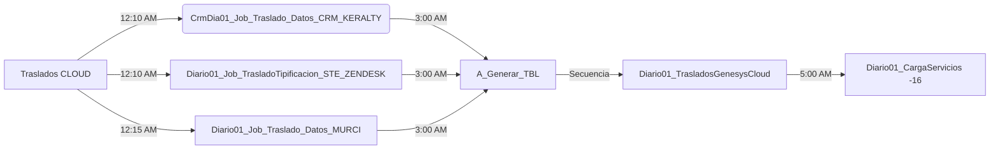
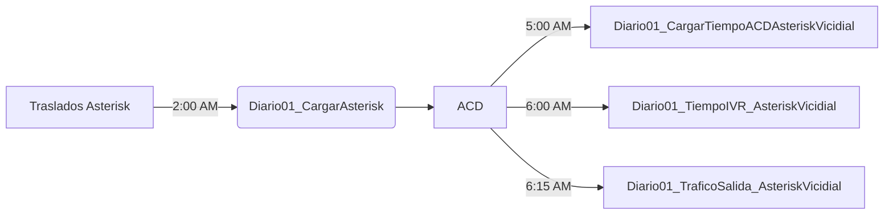

# Disponibilidad Cloud

*******

1. [Traslados Genesys Engage](#traslados-genesys-engage)
2. [Traslados Genesys Cloud](#traslados-genesys-cloud)
3. [Traslados Asterisk](#traslados-asterisk)
4. [Consultas para validar Cloud](#consultas-para-validar-cloud)
5. [Faltante de atributos para Genesys Cloud](#faltante-de-atributos-para-genesys-cloud)
6. [Clima Laboral](#clima-laboral)
7. [DBVerde](#dbverde)
8. [Vistas Tigo/Une (Epifanio)](#vistas-tigo/une-(epifanio))

*******

> [!WARNING]
> Se debe tener presente llenar el archivo diariamente de los procesos de traslados de Bi, se encuentra en Teams // Equpos // BI Reportes // Archivos // `MatrizDeCumplimientoBI.xlsx`.

> [!WARNING]
> Muchaches, les cuento que en las ETL Staging de Asterisk se deshabilitaron los procesos que truncan y llenan la tabla `CATDNIS_TBL_SKILL`. Luis Marulanda dijo que para no cambiar el proceso va a solicitar permisos en la misma para insertar los grupos nuevos en ella. La ETL debe pasar por allí, crear los horarios y los grupos en la dimensión.
`NO ejecutar paquetes que trunquen dicha tabla`.

> [!WARNING]
> Todos Chicos se modifica el horario de limpieza de trasnocho de la `campaña UNE_TELLAMAGEN` porfa para que lo tengan presente en la disponibilidad:
`Lunes a viernes` se ejecuta a las `7:25 AM`
`Sábado: 7:55 AM`
`Domingo: 8:55 AM`.

**Lista de Matriz de Cumplimiento**

| Matriz      | Hora       | Referencia     | Observación | 
| :----       |  :----     |  :----         |  :----      |
| JOB Mantenimiento Campañas      | `09:05 PM`| Diario01_Job_Mantenimiento_Campaña_UNE_TELLAMA  | La hora del servidor es `02:05 AM` y es en el servidor EC2|
| Usuarios | `09:20 PM`| Diario01_Job_Actualizacion_UserAll  | La hora del servidor es `02:20 AM` y es en el servidor EC2|
| CRM Keralty |`12:10 AM`| CrmDia01_Job_Traslado_Datos_CRM_KERALTY  |En el servidor EMT-EC2REPORT |
| TrasladoTipificacion_STE_ZENDESK| `12:10 AM`| Diario01_Job_TrasladoTipificacion_STE_ZENDESK  |En el servidor EMT-EC2REPORT |
| Traslado_Datos_MURCI            | `12:15 AM`| Diario01_Job_Traslado_Datos_MURCI               |En el servidor EMT-EC2REPORT |
| Traslados Asterisk           | `02:00 AM`| Diario01_CargarAsterisk               |En el servidor EMT-EC2REPORT |
| TBL_ReporteInteracciones (Resumen)| `03:00 AM`| A_Generar_TBL |La hora del servidor es `08:00 AM` y es en el servidor EC2 Step (3)|
| TBL_ReporteInteraccionesDetail (Segmentos)| `03:00 AM`| A_Generar_TBL |La hora del servidor es `08:00 AM` y es en el servidor EC2 Step (3)|
| TBL_ReporteinteraccionesIVRDetail (custom)| `03:00 AM`| A_Generar_TBL |La hora del servidor es `08:00 AM` y es en el servidor EC2 Step (3)|
| Encuestas| `03:00 AM`| A_Generar_TBL |La hora del servidor es `08:00 AM` y es en el servidor EC2 Step (4)|
| ACD      | `04:30 AM`| Diario01_Job_Extraccion_Agentes_GenesysCloud  || La hora del servidor es `09:40 AM` y es en el servidor EC2|
| Particiones| `05:30 AM`| Diario01_CargarBDUnica  |En el servidor EMT-EC2REPORT Step (4) |
| indicadores de gestión| `07:30 AM` | Diario01_Job_ApisGenesysCloud_Gets  |En el servidor EMT-EC2REPORT |
| BD_UNE y BD_CMV| `05:30 AM`| Diario01_CargarBDUnica |En el servidor EMT-EC2REPORT Step (1) |
| tbltipificacion| `05:30 AM`| Diario01_CargarBDUnica |En el servidor EMT-EC2REPORT Step (1) |
| BD_UNETELLAMA_API| `No` `06:45 AM` | Diario01_Job_ApisGenesysCloud_GetInteractions Diario01_Job_CargarArchivoTigoUNEPYMESDIGITAL_API_MAS_CLOUD    |En el servidor EMT-EC2REPORT |
| Medallia| Cada 5 minutos| OnLine01_Job_Carga_Eventbrige  |En el servidor 95 |
| Vistas Tigo/Une| Online y Dia vencido| se obtiene del proceso del 95 (General) y de los traslados |En el servidor 34 |
| indicadores Tuya| `06:35 AM`| Diario01_Job_CargaIndicadoresTuya_GenesysCloud |En el servidor EMT-EC2REPORT |
| Jobs CRM| `12:05 AM` a `05:00 AM`| 19 CRM  |En el servidor EMT-EC2REPORT |
| TABULAR| construcción| construcción  |construcción |


### Traslados Genesys Cloud


> [!WARNING]
> Este job fue creado por el DBA y realiza la limpieza de las tablas a utilizar en el cargue de la info `Staging_Maintenance` y corre a las `10:00 AM` Hora local.





**Interacciones y atributos Job EC2-INTERAXA**

| Job EC2                               | Organización | Hora Servidor               | Hora Local                    | Observación |
| :----                                 |  :----       |  :----                      |  :----                        |  :----      |
| Diario01_ConversationDetail           | Todas        | 06:30 PM                    |`01:30 PM`                     |Realiza la carga de todas las organizaciones del intervalo (6-12) |
| Diario01_ConversationDetail_emtelco10 | Emtelco10    | 07:05 PM/ 01:05 AM/07:05 AM |`02:05 PM/ 08:05 PM/ 02:05 AM` |Se carga Inbound, Outbound y atributos intervalo (6-12)-(12-18)(18-24)|
| Diario01_ConversationDetail_emtelco11 | Emtelco11    | 07:05 PM/ 01:05 AM/07:05 AM |`02:05 PM/ 08:05 PM/ 02:05 AM` |Se carga Inbound, Outbound y atributos intervalo (6-12)-(12-18)(18-24)|
| Diario01_ConversationDetail_emtelco12 | Emtelco12    | 07:05 PM/ 01:05 AM/07:05 AM |`02:05 PM/ 08:05 PM/ 02:05 AM` |Se carga Inbound, Outbound  (6-12)-(12-18)(18-24)|
| Diario01_ConversationDetail_emtelco13 | Emtelco13    | 07:05 PM/ 01:05 AM/07:05 AM |`02:05 PM/ 08:05 PM/ 02:05 AM` |Se carga Inbound, Outbound y atributos intervalo (6-12)-(12-18)(18-24)|
| Diario01_ConversationDetail_emtelco14 | Emtelco14    | 07:05 PM/ 01:05 AM/07:05 AM |`02:05 PM/ 08:05 PM/ 02:05 AM` |Se carga Inbound, Outbound y atributos intervalo (6-12)-(12-18)(18-24)|
| Diario01_ConversationDetail_emtelco15 | Emtelco15    | 07:05 PM/ 01:05 AM/07:05 AM |`02:05 PM/ 08:05 PM/ 02:05 AM` |Se carga Inbound, Outbound y atributos intervalo (6-12)-(12-18)(18-24)|
| Diario01_ConversationDetail_emtelco16 | Emtelco16    | 07:05 PM/ 01:05 AM/07:05 AM |`02:05 PM/ 08:05 PM/ 02:05 AM` |Se carga Inbound, Outbound y atributos intervalo (6-12)-(12-18)(18-24)|
| Diario01_ConversationDetail_emtelco17 | Emtelco17    | 07:05 PM/ 01:05 AM/07:05 AM |`02:05 PM/ 08:05 PM/ 02:05 AM` |Se carga Inbound, Outbound y atributos intervalo (6-12)-(12-18)(18-24)|
| Diario01_ConversationDetail_emtelco18 | Emtelco18    | 07:05 PM/ 01:05 AM/07:05 AM |`02:05 PM/ 08:05 PM/ 02:05 AM` |Se carga Inbound, Outbound y atributos intervalo (6-12)-(12-18)(18-24)|
| Diario01_ConversationDetail_emtelco19 | Emtelco19    | 07:05 PM/ 01:05 AM/07:05 AM |`02:05 PM/ 08:05 PM/ 02:05 AM` |Se carga Inbound, Outbound y atributos intervalo (6-12)-(12-18)(18-24)|
| Diario01_ConversationDetail_emtelco20 | Emtelco20    | 07:05 PM/ 01:05 AM/07:05 AM |`02:05 PM/ 08:05 PM/ 02:05 AM` |Se carga Inbound, Outbound y atributos intervalo (6-12)-(12-18)(18-24)|
| Diario01_ConversationDetail_emtelco21 | Emtelco21    | 07:05 PM/ 01:05 AM/07:05 AM |`02:05 PM/ 08:05 PM/ 02:05 AM` |Se carga Inbound, Outbound y atributos intervalo (6-12)-(12-18)(18-24)|
| Diario01_ConversationDetail_emtelco4  | Emtelco4     | 07:05 PM/ 01:05 AM/07:05 AM |`02:05 PM/ 08:05 PM/ 02:05 AM` |Se carga Inbound, Outbound y atributos intervalo (6-12)-(12-18)(18-24)|
| Diario01_ConversationDetail_emtelco5  | Emtelco5     | 07:05 PM/ 01:05 AM/07:05 AM |`02:05 PM/ 08:05 PM/ 02:05 AM` |Se carga Inbound, Outbound y atributos intervalo (6-12)-(12-18)(18-24)|
| Diario01_ConversationDetail_emtelco6  | Emtelco6     | 07:05 PM/ 01:05 AM/07:05 AM |`02:05 PM/ 08:05 PM/ 02:05 AM` |Se carga Inbound, Outbound y atributos intervalo (6-12)-(12-18)(18-24)|
| Diario01_ConversationDetail_emtelco8  | Emtelco8     | 07:05 PM/ 01:05 AM/07:05 AM |`02:05 PM/ 08:05 PM/ 02:05 AM` |Se carga Inbound, Outbound y atributos intervalo (6-12)-(12-18)(18-24)|
| Diario01_ConversationDetail_emtelco9  | Emtelco9     | 07:05 PM/ 01:05 AM/07:05 AM |`02:05 PM/ 08:05 PM/ 02:05 AM` |Se carga Inbound, Outbound y atributos intervalo (6-12)-(12-18)(18-24)|
| Diario01_ConversationDetail_emtelcosas| Emtelcosas   | 07:05 PM/ 01:05 AM/07:05 AM |`02:05 PM/ 08:05 PM/ 02:05 AM` |Se carga Inbound, Outbound y atributos intervalo (6-12)-(12-18)(18-24)|
|Diario01_Dimension                     | Todas        | 11:45 PM                    |`06:45 PM`                     |Carga las maestras que se necesitan para el proceso              |
|Diario01_ConversationDetail_Pending    | Todas        | 06:30 AM                    |`01:30 AM`                     |Carga las interacciones que son pendiente (faltan por finalizar) |
|Diario01_Participant_Attributes_emtelco12 | Emtelco12 | Cada 15 min 6:40 pm a 09:59 pm  |`Cada 15 min 1:40 pm a 04:59 pm ` |                                             |
|Diario01_Generar_TBL                   | Todas        | 08:00 AM  |`03:00 AM ` |Realiza la unión de las tablas por organización para cargar las de día y pasarlas al server Report  |

> [!WARNING]
> La ruta para el Log de error es  `\\EC2-INTERAXA\infoges\genesysCloud\logs`.


**Secuencia de Job**

<table>
    <thead>
        <tr>
            <th>Servidor 94</th>
             <th>Hora </th>
            <th>Pasos del job </th>
        </tr>
    </thead>
    <tbody>
        <tr>
            <td rowspan=2 align="left"><span class="emphasized">CrmDia01_Job_Traslado_Datos_CRM_KERALTY</span></td>
            <td rowspan=2 align="left"> 12:05 AM </td>
            <td align="left">1_TrasladoCRM</td>
        </tr>
        <tr>
            <td align="left">2_CargarStagigOperacion</td>
        </tr>
    </tbody>
</table>


|Inicio EC2	               | Pasos                 | Llamado en DWH Report          | Pasos DWH Report                                 | Llamado del job principal                                 | Observación                   |
| :----                    |    :----              |  :----                         |:----                                             |  :----                                                    |  :----                        |
|Diario01_Generar_TBL `3:00 AM`   | 1. load_TBL_Principal |                                | 1. Carga Tbl del EC2 al 94                       |                                                           |                               |
|	                       | 2. Consolidar_TBL     |                                | 2. Step_Carga_DimUsuariosCloud                   |                                                           |                               |
|	                       | 3. load DWH           | Diario01_TrasladosGenesysCloud | 3. Cargar_TipiCRM                                |  Diario01_Job_CargaTipificacionCRM                        |                               |
|	                       | 4. Audit              |                                | 4. BD_Unica                                      |                                                           |                               |
|	                       |                       |                                | 5. Cargar_Chat_Confiar                           |  Diario01_Job_Cargar_Chat_Confiar_Cloud                   | Se carga las encuestas, el chat y tipi de murci |
|	                       |                       |                                | 6. Encuestas cloud                               |                                                           |                               |
|	                       |                       |                                | 7. PartitionInteracciones_GC                     |                                                           | Se cargan las tablas terminadas en EMTELCO12, EMTELCOALL Y EMTELCOSAS|
|	                       |                       |                                | 8. CargarArchivoTigoUNETELLAMAGEN_API_MAS_CLOUD  |  Diario01_Job_CargarArchivoTigoUNETELLAMAGEN_API_MAS_CLOUD|                               |
|	                       |                       |                                | 9. Diario01_Job_CargaIndicadoresTuya_GenesysCloud |  | Carga diaria de Indicadores, actualmente solo carga cliente TUYA y se pobla la tabla en dwh [FactIndicadoresGrupoGenesysCloud] ,tener en cuenta las siguientes dependencias de otros  jobs: Diario01_Job_CargaACD_GenesysCloud y Diario01_PartitionInteracciones_GC                              |
|	                       |                       |                                |10. CargarAcumuladoIVRB2BGenesysCloud             |                                                           |                               |
|	                       |                       |                                |11. CallBack1Minuto                               |  Diario01_Job_ExtraerContacts_CallBack1Minuto             |                               |
|	                       |                       |                                |12. TiempoConversando                             |  Diario01_Job_ActualizarHTipificacion-TiempoConversado    |                               |
|	                       |                       |                                |13. Cargar_TablaInteraccionesDetail_ClinicaCountry|  Cargar_TablaInteraccionesDetail_ClinicaCountry           |                               |
|	                       |                       |                                |14. ContadorOpcionesGC                            |                                                           |                               |

**Job EC2-INTERAXA ACD**

|Inicio EC2	                                  | Hora Servidor | Hora Local | Paso | DWH 94                             | 
| :----                                       |    :----      |  :----     |:----:|  :----                             |
|Diario01_Job_Extraccion_Agentes_GenesysCloud |  9:40 AM      |  `4:40 AM` | 2    |Diario01_Job_CargaACD_GenesysCloud  |
|	                                          |               |            |      |                                    |
|	                                          |               |            | 3    |Diario01_Job_ApisGenesysCloud_Gets  |
|	                                          |               |            |      |                                    |

**Job Server 16 ACD**

| Fatura 16                          | Hora Servidor| Hora Local |
|  :----                             |:----         |  :----     |
|Diario01_TraficoSalida_GenesysCloud |7:30 AM       |`7:30 AM`   |
|                                    |              |            |


Despues de cargar las tbl se deben garantizar estos job 

| Fatura 16              | Hora Servidor|
|  :----                 |:----         |
|Diario01_CargaServicios |`6:00 AM`     |

### Traslados Asterisk


<table>
    <thead>
        <tr>
            <th>Servidor 94</th>
             <th>Hora </th>
            <th>Pasos del job </th>
        </tr>
    </thead>
    <tbody>
        <tr>
            <td rowspan=6 align="left"><span class="emphasized">Diario01_CargarAsterisk</span></td>
            <td rowspan=6 align="left"> 2:00 AM </td>
            <td align="left">02_02_Carga_operacion_medellin4</td>
        </tr>
        <tr>
            <td align="left">03_Carga_Opercaion_Bogota</td>
        </tr>
        <tr>
            <td align="left">04_Carga_Dwh_Asterisk</td>
        </tr>
        <tr>
            <td align="left">02_Carga_Operacion_Medellin2</td>
        </tr>
        <tr>
            <td align="left">02_01_Carga_operacion_medellin3</td>
        </tr>
    </tbody>
</table>
<table>
    <thead>
        <tr>
            <th>Servidor 16</th>
             <th>Hora </th>
        </tr>
    </thead>
    <tbody>
        <tr>
            <td rowspan=1 align="left"><span class="emphasized">Diario01_CargarTiempoACDAsteriskVicidial</span></td>
            <td rowspan=1 align="left"> 05:00 AM </td>
        </tr>
        <tr>
            <td rowspan=1 align="left"><span class="emphasized">Diario01_TiempoIVR_AsteriskVicidial</span></td>
            <td rowspan=1 align="left"> 06:00 AM </td>
        </tr>
        <tr>
            <td rowspan=1 align="left"><span class="emphasized">Diario01_TraficoSalida_AsteriskVicidial</span></td>
            <td rowspan=1 align="left"> 06:15 AM </td>
        </tr>
    </tbody>
</table>


### Clima Laboral 

| DWH 94                                              | Hora Servidor|
|  :----                                              |:----         |
|Diario01_Job_Cargue_Encuestas_Repositorio_Fuentes    |`1:10 AM`     |


Se debe garantizar que el paso 2 del  JOB __Diario01_Job_Cargue_Encuestas_Repositorio_Fuentes__ termine antes de las __6:00 AM__ ,debido a que desde talento humano estan haciendo el exporte de la data a esta hora.

### DBVerde

| EC2                    | Hora Servidor       |
|  :----                 |:----                |
|Diario01_Job_DBVerde    |`Corre cada hora`    |

**Nota :** 
El Job de DBVerde depende del archivo que colocan en la ruta de la FTP `/B2B/BD Verde Enrutamientos IVR B2B`, nombre del archivo `Actualizacion.csv`.

### Consultas para validar Cloud 

Consulta para validar el correcto traslados de los datos desde el EC2. 

```plsql
use Staging
go
EXEC  [emtelco].[getAudit_RowCountTable]
```

Consultas.

```plsql
USE [Staging]
GO
EXEC [emtelco].[getAudit_RowCount]
	@organization = N'emtelco12'
;
GO 

USE [Staging]
GO
EXEC [emtelco].[getAudit_Intervals]
	@date = N'2024-03-11',
	@organization = N'emtelco12'
;
GO

select Max(createdAt) from [emtelco12].[Participant_Attributes]

```


Consulta para validar datos de las TBL luego de correr el proceso en el EC2 en el server Report. `Validar que esten las 12 organizaciones y que tengan datos y se ver info de las tablas de día y las particionadas, validar despues de correr la BDUnica`

```plsql
declare
	@fecha as date = '2024-03-10';
	--@titulo as nvarchar(50);
 
with resumen as (
	select convert(date, [fechaHoraIngreso]) as fecha, organizacion, count(1) as cantidad
	from TBL_ReporteInteracciones_Cloud_Dia with(nolock)
	where fechaHoraIngreso >= @fecha
	group by convert(date, [fechaHoraIngreso]),organizacion
), Detail as (
	select convert(date, [fechaHoraIngreso]) as fecha,organizacion, count(1) as canidad
	from TBL_ReporteInteraccionesDetail_Cloud_Dia with(nolock)
	where fechaHoraIngreso >= @fecha
	group by convert(date, [fechaHoraIngreso]),organizacion
), IVRDetail as (
	select convert(date, [fechaHoraIngreso]) as fecha,organizacion, count(1) as canidad
	from TBL_ReporteInteraccionesIVRDetail_Dia with(nolock)
	where fechaHoraIngreso >= @fecha
	group by convert(date, [fechaHoraIngreso]),organizacion
)
 
--select 'TBL ReporteInteracciones Detail Dia'
select r.fecha, r.organizacion, r.cantidad as Interacciones_Cloud_Dia, d.canidad as InteraccionesDetail_Cloud_Dia, i.canidad as InteraccionesIVRDetail_Dia
from resumen as r
left join Detail as d on r.fecha = d.fecha and r.organizacion = d.organizacion
left join IVRDetail as i on i.fecha = d.fecha and r.organizacion = i.organizacion
order by r.fecha, r.organizacion;
 
with resumen_EMTELCO12 as (
	select convert(date, [fechaHoraIngreso]) as fecha,organizacion ='emtelco12',count(1) as cantidad
	from TBL_ReporteInteracciones_Cloud_EMTELCO12 with(nolock)
	where fechaHoraIngreso >= @fecha
	group by convert(date, [fechaHoraIngreso])
), Detail_EMTELCO12 as (
	select convert(date, [fechaHoraIngreso]) as fecha,organizacion ='emtelco12',count(1) as cantidad
	from TBL_ReporteInteraccionesDetail_Cloud_EMTELCO12 with(nolock)
	where fechaHoraIngreso >= @fecha
	group by convert(date, [fechaHoraIngreso])
), IVRDetail_EMTELCO12 as (
	select convert(date, [fechaHoraIngreso]) as fecha, organizacion ='emtelco12',count(1) as cantidad
	from TBL_ReporteInteraccionesIVRDetail_EMTELCO12 with(nolock)
	where fechaHoraIngreso >= @fecha
	group by convert(date, [fechaHoraIngreso])
)
 
--select 'TBL ReporteInteracciones EMTELCO12'
select r.fecha, r.organizacion, r.cantidad as Interacciones_Cloud_Dia, d.cantidad as InteraccionesDetail_Cloud_Dia, i.cantidad as InteraccionesIVRDetail_Dia
from resumen_EMTELCO12 as r
left join Detail_EMTELCO12 as d on r.fecha = d.fecha and r.organizacion = d.organizacion
left join IVRDetail_EMTELCO12 as i on r.fecha = i.fecha and r.organizacion = i.organizacion;
 
with resumen_EMTELCOALL as (
	select convert(date, [fechaHoraIngreso]) as fecha, organizacion,count(1) as cantidad
	from TBL_ReporteInteracciones_Cloud_EMTELCOALL with(nolock)
	where fechaHoraIngreso >= @fecha
	group by convert(date, [fechaHoraIngreso]), organizacion
), Detail_EMTELCOALL as (
	select convert(date, [fechaHoraIngreso]) as fecha, organizacion,count(1) as cantidad
	from TBL_ReporteInteraccionesDetail_Cloud_EMTELCOALL with(nolock)
	where fechaHoraIngreso >= @fecha
	group by convert(date, [fechaHoraIngreso]), organizacion
), IVRDetail_EMTELCOALL as (
	select convert(date, [fechaHoraIngreso]) as fecha, organizacion,count(1) as cantidad
	from TBL_ReporteInteraccionesIVRDetail_EMTELCOALL with(nolock)
	where fechaHoraIngreso >= @fecha
	group by convert(date, [fechaHoraIngreso]), organizacion
)
 
--select @titulo = 'TBL ReporteInteracciones EMTELCOALL';
select r.fecha, r.organizacion, r.cantidad as Interacciones_Cloud_Dia, d.cantidad as InteraccionesDetail_Cloud_Dia, i.cantidad as InteraccionesIVRDetail_Dia
from resumen_EMTELCOALL as r
left join Detail_EMTELCOALL as d on r.fecha = d.fecha and r.organizacion = d.organizacion
left join IVRDetail_EMTELCOALL as i on r.fecha = i.fecha and r.organizacion = i.organizacion
order by r.organizacion;
 
with resumen_EMTELCOSAS as (
	select convert(date, [fechaHoraIngreso]) as fecha, organizacion = 'EMTELCOSAS',count(1) as cantidad
	from TBL_ReporteInteracciones_Cloud_EMTELCOSAS with(nolock)
	where fechaHoraIngreso >= @fecha
	group by convert(date, [fechaHoraIngreso])
), Detail_EMTELCOSAS as (
	select convert(date, [fechaHoraIngreso]) as fecha, organizacion = 'EMTELCOSAS',count(1) as cantidad
	from TBL_ReporteInteraccionesDetail_Cloud_EMTELCOSAS with(nolock)
	where fechaHoraIngreso >= @fecha
	group by convert(date, [fechaHoraIngreso])
), IVRDetail_EMTELCOSAS as (
	select convert(date, [fechaHoraIngreso]) as fecha, organizacion = 'EMTELCOSAS',count(1) as cantidad
	from TBL_ReporteInteraccionesIVRDetail_EMTELCOSAS with(nolock)
	where fechaHoraIngreso >= @fecha
	group by convert(date, [fechaHoraIngreso])
)
--select @titulo = 'TBL ReporteInteracciones EMTELCOSAS';
select r.fecha, r.organizacion, r.cantidad as Interacciones_Cloud_Dia, d.cantidad as InteraccionesDetail_Cloud_Dia, i.cantidad as InteraccionesIVRDetail_Dia
from resumen_EMTELCOSAS as r
left join Detail_EMTELCOSAS as d on r.fecha = d.fecha and r.organizacion = d.organizacion
left join IVRDetail_EMTELCOSAS as i on r.fecha = i.fecha and r.organizacion = i.organizacion
order by r.organizacion;
```


Consulta para validar que las tablas del EC2 tengan información.

```plsql
USE [Staging]
GO
DROP TABLE IF EXISTS #getAudit
create table #getAudit(
	companyShortName nvarchar(50) null,
	TableName nvarchar(50) null,
	[RowCount] int null
)
DECLARE @columns nvarchar(MAX);
DECLARE @sql nvarchar(MAX)
 
insert into #getAudit
	EXEC [emtelco].[getAudit_RowCount]
 
SELECT @columns = STUFF(
	(
	SELECT
	   ',' + QUOTENAME(LTRIM(TableName))
	FROM
	(SELECT DISTINCT TableName
		FROM #getAudit
	) as T
	ORDER BY TableName
FOR XML PATH('')
), 1, 1, '');
 
SET @sql = N'
SELECT   * 
  FROM
  (  
    SELECT companyShortName
         , TableName
         , [RowCount]
FROM #getAudit
  ) AS T
  PIVOT   
  (
  SUM([RowCount])
  FOR TableName IN (' + @columns + N')
  ) AS P;';
 
  EXEC sp_executesql @sql;
```
Consultas. 

```plsql
USE [Staging]
GO
EXEC [emtelco].[getAudit_RowCount]
	@organization = N'emtelco12'
;
GO 

USE [Staging]
GO
EXEC [emtelco].[getAudit_Intervals]
	@date = N'2024-03-11',
	@organization = N'emtelco12'
;
GO
```

### Vistas Tigo/Une (Epifanio)
Estas vistas se generan para que el cliente tenga acceso a las trazas opciones, trazas técnicas y encuestas a partir de las fuentes de información que se generan a diario, para la información histórica se consumen las tablas del DWH_Operacion y para la información online se consume el eventbridge del servidor 95. Las vistas actualmente permiten consultar una ventana de tiempo de 3 meses.


